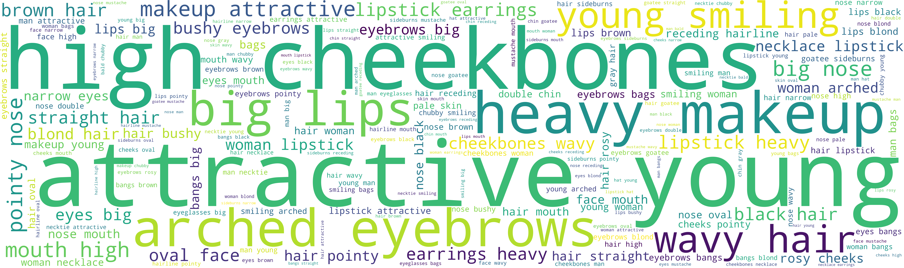

# CelebA-Text-Identity
Due to the lack of available face datasets with natural language descriptions, we propose the CelebA-Text-Identity dataset for text-based face retrieval based on the public CelebA face dataset.
The CelebA-Text-Identity dataset comprises of 205,599 facial images of 6,217 unique identities, each accompanied by a corresponding textual description.
Following the example of Multi-Modal-CelebA-HQ, the facial descriptions in CelebA-Text-Identity are generated by utilizing all the facial attributes linked with the CelebA dataset. Textual descriptions are produced using a context-free grammar (CFG) based on the provided attributes. 
To better align with common describing practices, the generated description first provides overall impression, before focusing on facial details and features. 
